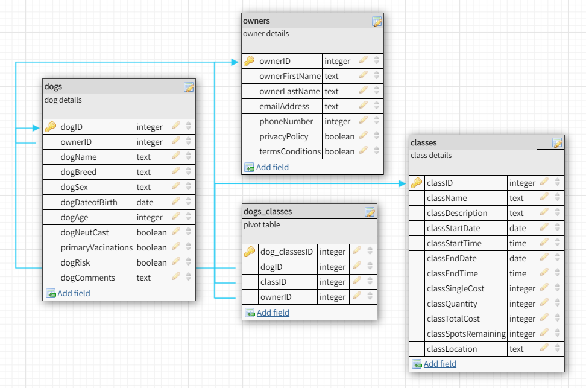

# Minds Alike Database (MVP for CodeOp)

## My MVP

To create a database using MySQL to store training class information. Later to add accessability to pick out bits of data.

## Objectives

- Build a database.
- Create four tables.
- Build an API server.

### Database schema

Link to DB Designer:
https://app.dbdesigner.net/designer/schema/274995

### API route plans

| URI                          | HTTP Method | Description                            | Req Object | Res Object |
| ---------------------------- | ----------- | -------------------------------------- | ---------- | ---------- |
| /classes                     | GET         | Get all data from classes              | none       | INT        |
| /classes/:classID            | GET         | Get list of specific class             | none       | INT        |
| /dog_classes/:classID/:dogID | GET         | Get list of dogs taking specific class | none       | INT        |
| /dogs                        | GET         | Get all data from dogs                 | none       | INT        |
| /dogs/:dogID                 | GET         | Get list of specific dog               | none       | INT        |
| /dog_classes/:dogID/:classID | GET         | Get class list for specific dog        | none       | INT        |

## Setup

### Dependencies

Run `yarn` on root folder to install dependencies related to Express.

`cd client` and run `yarn` install dependencies related to React.

### Database Prep

Create `.env` file in project directory and add `DB_PASS=YOURPASSWORD`. You can also rename the provided `.env.example` file.

Type `mysql -u root -p` to access the MySQL CLI using your password.

In the MySQL CLI, type `create database todos;` to create a database in MySQL.

Run the following in the MySQL CLI: `ALTER USER 'root'@'localhost' IDENTIFIED WITH mysql_native_password BY 'YOUR_PASSWORD';`

Run `node model/database.js` in your **TERMINAL** (not your MySQL CLI! Open a new terminal window for this). This will create a table called 'items' in your database.

### Run Your Development Servers

- Run `yarn start` in project directory to start the Express server on port 5000
- `cd client` and run `yarn start` to start client server in development mode with hot reloading in port 3000.
- Client is configured so all API calls will be proxied to port 5000 for a smoother development experience. Yay!
- You can test your client app in `http://localhost:3000`
- You can test your API in `http://localhost:5000/api`

## Basic Requirements

Suggested Process:

- Try and write the correct query in `mysql`.
- Use that query to finish the endpoint in `routes/api.js`.
- Test your endpoint using Postman.

To Do:

- [ ] Use Postman to confirm that you have completed these correctly
- [ ] GET `/api/v1/todos` should retrieve all resources.
  - This route is almost complete!
- [ ] POST `/api/v1/todos` should create a new resource.
  - To test that your query is correct, check to see if your new resource exists using `mysql`.
  - To test your route, use Postman to see if GET `api/v1/todos` returns your new resources.
- [ ] PUT `/api/v1/todos/:id` should replace a resource.
  - To test that your query is correct, check to see if your updated resource exists using `mysql`.
  - To test your route, use Postman to see if GET `api/v1/todos` includes your updated resources.
- [ ] DELETE `/api/v1/todos/:id` should delete a resource.
  - To test that your query is correct, check to see if your resource was deleted using `mysql`.
  - To test your route, use Postman to see if GET `api/v1/todos` does not include your new resources.

## Resources

- [MySQL Cheat Sheet](http://www.mysqltutorial.org/mysql-cheat-sheet.aspx)
- [MySQL](https://dev.mysql.com/doc/refman/8.0/en/database-use.html)
- [Fetch](https://developer.mozilla.org/en-US/docs/Web/API/Fetch_API/Using_Fetch)
- [Promises](https://developer.mozilla.org/en-US/docs/Web/JavaScript/Reference/Global_Objects/Promise)

## Notes

_This is a student project that was created at [CodeOp](http://CodeOp.tech), a full stack development bootcamp in Barcelona._
